# util_calculate (en-US)

This document organizes the business logic and data flow of `genLifeCycleModelProcesses`, to help understand the overall process of generating/updating submodels for a life cycle model.

## Function signature and responsibilities

- Function: `genLifeCycleModelProcesses(id, modelNodes, lifeCycleModelJsonOrdered, oldSubmodels)`
- Inputs:
  - `id: string` Model ID of the current life cycle model (primary model).
  - `modelNodes: any[]` Canvas/model nodes list (with node metadata, e.g., quantitativeReference, targetAmount).
  - `lifeCycleModelJsonOrdered: any` LCA model JSON organized with standard structure (includes technology.processes.processInstance etc.).
  - `oldSubmodels: any[]` Existing submodel records (used to decide update/reuse in subsequent runs).
- Output:
  - `{ lifeCycleModelProcesses: any[] }` Generated (or updated) submodel array (empty items filtered out).
- Responsibilities:
  - Build directed edges from model and database processes (upstream → downstream, matched by flow) and mark dependence directions.
  - Propagate scaling factors from the reference process, group by primary/secondary connections, and perform supply-demand allocation.
  - Form "allocated child processes"; from candidate final products, group, scale and aggregate exchanges, compute LCIA, and then create or update submodel data.

## Key data and concepts

- Reference Process
  - Source: `lifeCycleModelInformation.quantitativeReference.referenceToReferenceProcess` (nodeId).
  - Corresponding model node: the node in `modelNodes` where `data.quantitativeReference === '1'`.
  - Reference exchange (Ref Exchange): the exchange in the database process that matches the quantitative reference; used to determine reference direction (INPUT/OUTPUT) and reference flow ID.
- Scaling factor
  - `refScalingFactor = modelTargetAmount / refModelMeanAmount` (when both are non-zero).
  - Propagated across the graph along dependence relationships via `calculateScalingFactor` to related nodes and exchanges.
- Dependence direction (dependence)
  - `assignEdgeDependence` marks each edge with `dependence ∈ { upstream, downstream, none }`, which determines whether it goes into the primary or secondary grouping.
- Supply-demand allocation (Allocation)
  - For aggregated exchanges of each node, build supply (OUTPUT) and demand (INPUT) dictionaries keyed by `${nodeId}:${flowId}`.
  - Use `allocateSupplyToDemand(supply, demand, edges)` to solve matching for primary/secondary groups separately, and output allocations and remaining supply/demand.
- Child process (Allocated Process)
  - Split into "allocated OUTPUT" and "non-allocated/others" based on aggregation; used for subsequent grouping and scaling.
- Final product group
  - Start from a child process where `finalProductType === 'has'`, and recursively collect the same subproduct chain to form a group for aggregation and LCIA.

## Execution steps (high level)

1. Read the reference process nodeId and validate it; locate the reference model node and its target amount `modelTargetAmount`.
2. Build model process list and map (`mdProcesses`, `mdProcessMap`).
3. Batch query database processes by process id/version referenced in the model (`supabase.from('processes')...`) and build `dbProcessMap`:
   - Parse exchanges list, find the reference exchange, determine reference flow ID and direction; build INPUT/OUTPUT indices by flowId.
4. Compute the reference scaling factor `refScalingFactor`.
5. Graph and marking: `buildEdgesAndIndices` generates `up2DownEdges` and two indices; `assignEdgeDependence` marks edge dependence types.
6. Scaling propagation: call `calculateScalingFactor` starting from the reference process to get scaling records `processScalingFactors` for all involved processes.
7. Aggregation: `sumAmountByNodeId` aggregates scaling and exchanges by nodeId to get `sumAmountNodeMap`, and separates `mainConnectExchanges`, `secondaryConnectExchanges`, `noneConnectExchanges`.
8. Build supply and demand, then allocate:
   - For primary and secondary groups, scan `sumAmountNodeMap` to build supply/demand dictionaries and edge lists.
   - Call `allocateSupplyToDemand` separately to get `mainAllocateResult` and `secondaryAllocateResult`.
9. Write back remaining amounts and edge states:
   - Map each group's `remaining_supply`/`remaining_demand` back to nodes and compute `remainingRate`.
   - Update `up2DownEdges` with `exchangeAmount`, `isBalanced`, and `unbalancedAmount`.
10. Form child processes: `allocatedProcess(sumAmountNodeMap)`.
11. Find candidate final products: filter child processes with `finalProductType === 'has'`.
12. Group and scale:
    - For each candidate, use `getFinalProductGroup` to collect processes in the same group.
    - Call `calculateProcess` to scale processes in the group according to `childAllocatedFraction` and `childScalingPercentage`, and obtain `resultExchanges`.
13. In-group aggregation and reference marking: `sumProcessExchange` aggregates exchanges by direction and flowId and marks the quantitative reference.
14. Create (or update) submodels:
    - For primary group, `option=update`, `newId=id`; for secondary group, default `option=create`, `newId=v4()`, but if a match is found in `oldSubmodels`, set `option=update` and reuse the old id.
    - For the primary group, align the reference exchange with the model target amount (overwrite mean/resulting).
    - Compute LCIA: `LCIAResultCalculation(newExchanges)`.
    - Assemble `processDataSet`, `LCIAResults`, etc., to output a submodel record.
15. Write back processInstance: update `@multiplicationFactor` for each `processInstance` based on aggregated `scalingFactor`.
16. Return `{ lifeCycleModelProcesses }` with empty items filtered out.

### Execution flowchart

Below is a Mermaid flowchart showing the main data objects and their transformations in `genLifeCycleModelProcesses` (from input to output), for a quick understanding of the end-to-end pipeline:

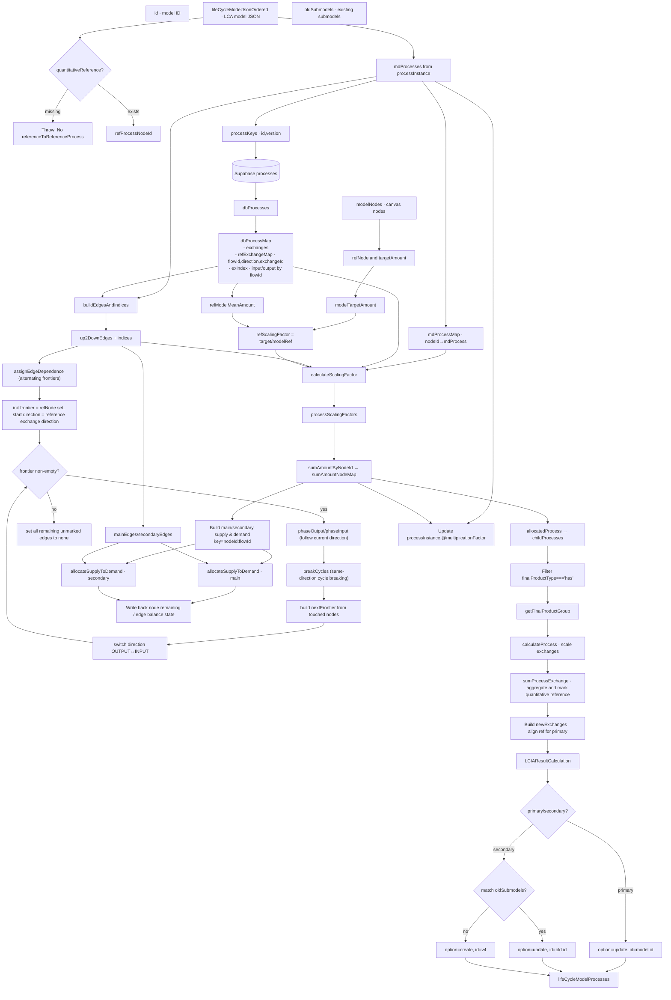

Notes:

- The key for supply-demand matching is nodeId:flowId; grouping depends on `dependence ∈ {upstream, downstream, none}`.
- For the primary group, the reference exchange amount will be aligned to `modelTargetAmount` when generating the submodel.
- Old submodels are matched by `nodeId / processId / allocatedExchange{FlowId,Direction}` to decide update or create.

- When modifying tolerance or priority strategy of `allocateSupplyToDemand`, please also update relevant unit tests and the "Edge cases" part of this doc.
- When introducing new grouping logic or `dependence` types, consider:
  1. The allocation channels for up/down edges;
  2. The allocated/non-allocated split in `allocatedProcess`;
  3. Whether the aggregation key (direction×flowId) in `sumProcessExchange` needs extension.

## Detailed method documentation (key helpers)

The following methods are directly or indirectly used along the main pipeline of "graph → dependence → scaling → allocation → aggregation → LCIA", grouped by appearance and call relations.

### buildEdgesAndIndices(mdProcesses, dbProcessMap)

- Location: `src/services/lifeCycleModels/util_calculate.ts`
- Purpose:
  - From `processInstance` in the LCA model, generate upstream→downstream edges `Up2DownEdge[]`;
  - Compute and set each node's main output flow (mainOutputFlowUUID) and main input flow (mainInputFlowUUID);
  - Build two lookup indices: `edgesByDownstreamInput (nodeId→incoming edges)` and `edgesByUpstreamOutput (nodeId→outgoing edges)`.
- Inputs:
  - `mdProcesses: any[]` Model process instance list;
  - `dbProcessMap: Map<string, DbProcessMapValue>` Database process map (with exchanges and refExchangeMap).
- Output: `{ up2DownEdges, edgesByDownstreamInput, edgesByUpstreamOutput }`
- Key points:
  - Main output flow: prefer the database reference OUTPUT flowId; otherwise pick the OUTPUT flow with the highest allocation fraction within the allowed set;
  - Main input flow: if multiple incoming edges exist, prefer database reference INPUT; otherwise pick the INPUT flow with the highest allocation fraction among incoming flows;
  - Internal selection uses `selectMaxAllocatedFlowId` and `comparePercentDesc` (order by allocation fraction).
- Edge cases: if a node has no output/input, the main flow UUID is an empty string; if no matching flow exists, it is not set.

Flowchart:

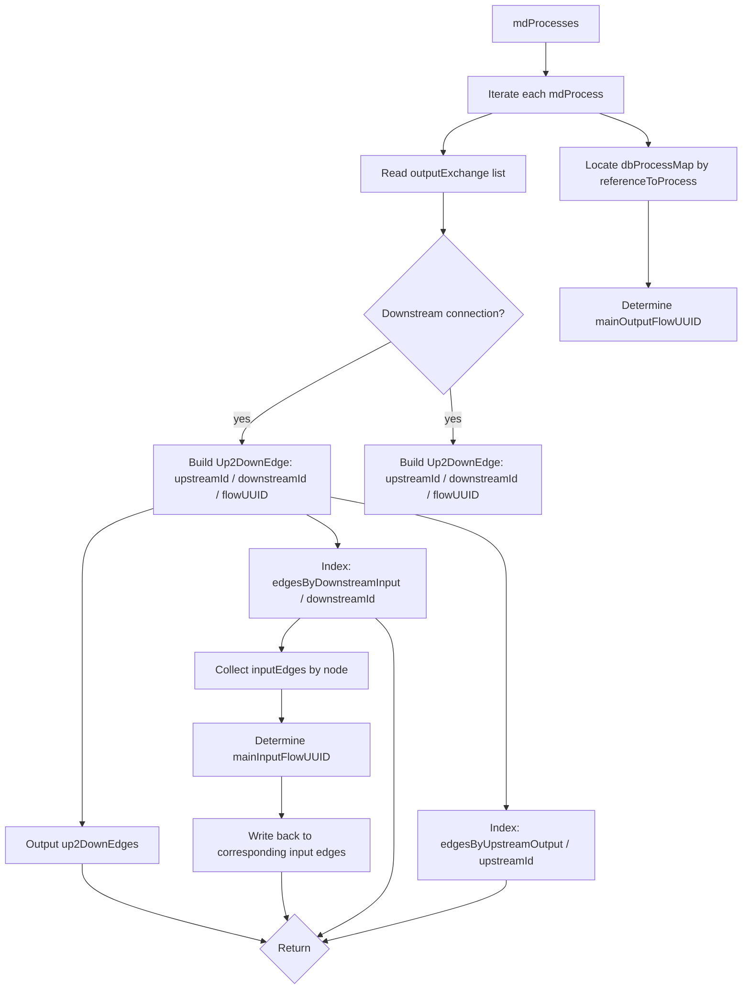

### assignEdgeDependence(up2DownEdges, edgesByDownstream, edgesByUpstream, refProcessNodeId)

- Location: same as above
- Purpose: starting from the reference node, alternately expand OUTPUT/INPUT directions and mark each edge with `dependence ∈ {downstream, upstream, none}`; when multiple edges exist in the same direction, keep only the "main flow" as the primary dependence, set others to `none`, and record `mainDependence`.
- Inputs: built edges and indices, and the reference node ID
- Output: in-place modification of `up2DownEdges` (writing dependence/mainDependence)
- Key points:
  - Alternating expansion: start from the reference exchange direction and alternate phaseOutput/phaseInput with a "frontier" until no new nodes are added; after each phase, perform same-direction cycle breaking (breakDownstreamCycles or breakUpstreamCycles).
  - After marking completes, any still-unmarked edges are set to `none` (treated as the secondary group).
  - Within each phase, deduplicate by node: for the same upstream node, keep only the main OUTPUT flow as downstream dependence; for the same downstream node, keep only the main INPUT flow as upstream dependence; others are set to `none` with `mainDependence` recorded.
  - Advance the next frontier only from nodes that still have unmarked edges for efficiency.

Flowchart:

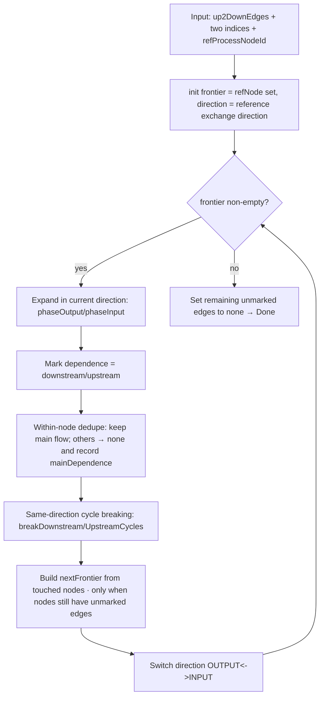

### calculateScalingFactor(currentModelProcess, currentDatabaseProcess, ...)

- Location: same as above
- Purpose: from the current node, traverse both ways along dependence-marked edges; match by shared `flowUUID` between adjacent processes to propagate scaling; collect scaled exchanges and grouping (main/secondary/none) for each node.
- Inputs:
  - `currentModelProcess, currentDatabaseProcess` Starting model/db process;
  - `dependence` Starting context (the first can be an empty-shell object);
  - `scalingFactor` Starting scaling factor (reference scaling factor);
  - `edgesByDownstreamInput, edgesByUpstreamOutput, mdProcessMap, dbProcessMap` Graph and indices.
- Output: `any[]` (process scaling records including nodeId, scalingFactor, three exchange groups, baseExchanges, etc.)
- Algorithm:
  - For the current node: multiply database exchanges by the current `scalingFactor` to get scaled exchanges;
  - For input edges expect dependence=downstream; for output edges expect dependence=upstream;
  - Adjacent scaling propagation: `nextScaling(target=currentMean, base=adjacentMean, curSF=scalingFactor)`, and write back `exchangeAmount` on the edge.

Flowchart:

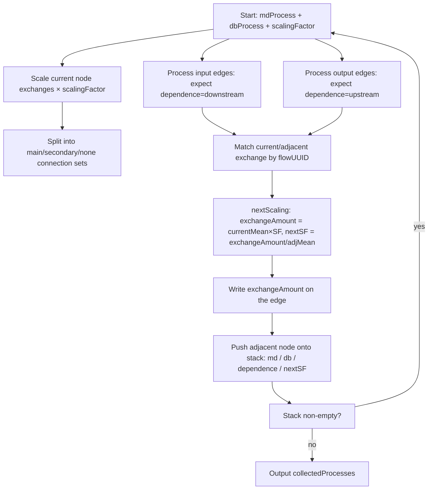

### sumAmountByNodeId(processScalingFactors)

- Location: same as above
- Purpose: group process scaling records by `nodeId`: sum `scalingFactor/count` and merge three exchange groups and the full exchange list.
- Returns: `Map<string, any>` (nodeId → aggregated entry)
- Filter: records with `scalingFactor==0` or missing `nodeId` will be skipped.

Flowchart:

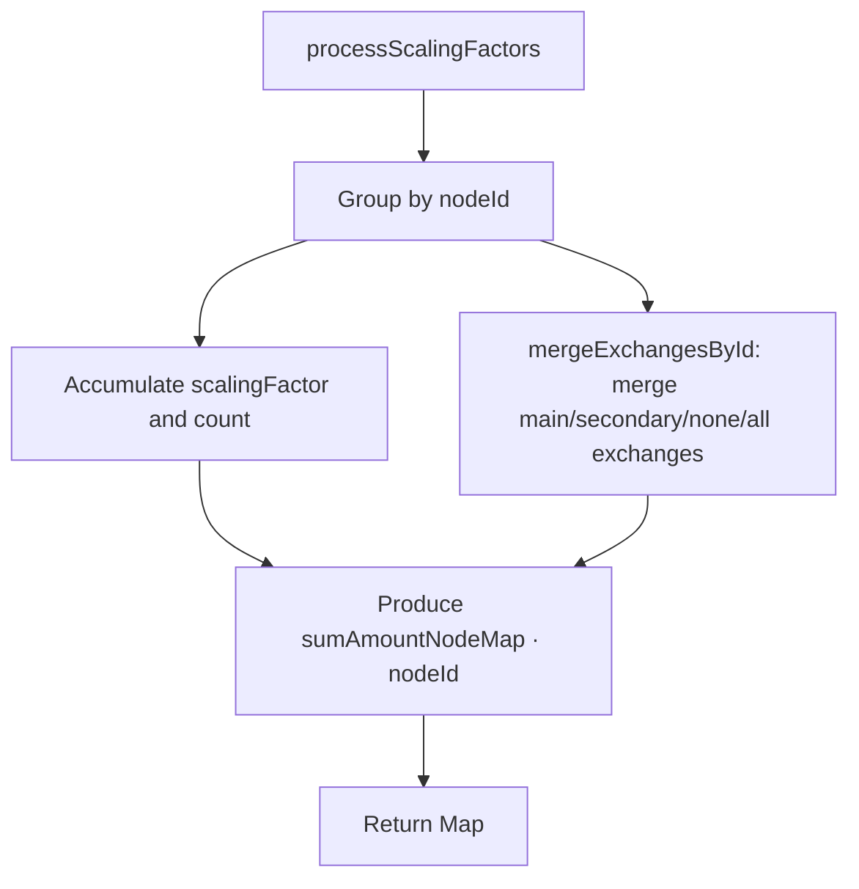

### allocateSupplyToDemand (max flow allocation)

- Location: `src/services/lifeCycleModels/util_allocate_supply_demand.ts`
- Purpose: given supplies/demands and allowed edges, use Edmonds–Karp max flow to allocate; supports heuristic `prioritizeBalance`, absolute/relative tolerance.
- Contract:
  - supplies/demands are non-negative; edges are an iterator of `[u,v]` pairs (`u/v` are `nodeId:flowId`);
  - `edgeCapacities` uses `${u}→${v}` as key (Unicode arrow) to specify capacities; default capacity is `max(totalSupply,totalDemand)` if unspecified;
  - Output quadruple: `{ allocations, remaining_supply, remaining_demand, total_delivered }`;
  - Tolerance: `eps = max(tolerance, relTolerance * scale)`, `scale = max(totalSupply,totalDemand)`; when totals are very small, reduce tolerance accordingly to keep valid flow.
- Algorithm:
  - Build capacity graph: `SOURCE→supplies; demands→SINK; u→v` as business edges;
  - BFS augment layer by layer; with `prioritizeBalance`, prioritize paths with smaller supply/demand first;
  - Summarize only business edges into `allocations`, and compute remaining supply/demand per node.

Flowchart:

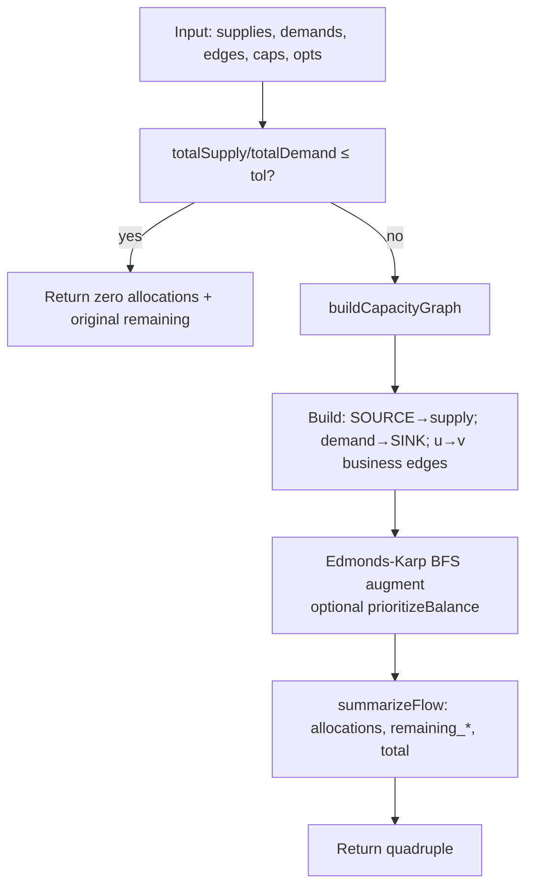

### Write-back of allocation result (pushRemainingForGroup / applyAllocationToEdge)

Flowchart:

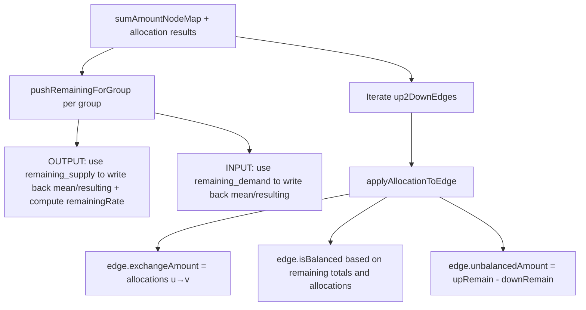

### allocatedProcess(sumAmountNodeMap)

- Location: same as above
- Purpose: based on aggregated node results, split exchanges into "allocated OUTPUT" and "non-allocated/other" to produce a list of child processes for grouping/scaling.
- Rules:
  - If there exists OUTPUT with valid `allocations/allocation.@allocatedFraction`, add to the allocated set;
  - If no allocated OUTPUT exists but the reference exchange is OUTPUT, use the reference OUTPUT as fallback (fraction=1);
  - If the reference OUTPUT was not chosen as allocated, keep it in the non-allocated set;
  - If `remainingRate(0<r<1)` exists, split into two child processes (has/no) with complementary fractions.

Flowchart:

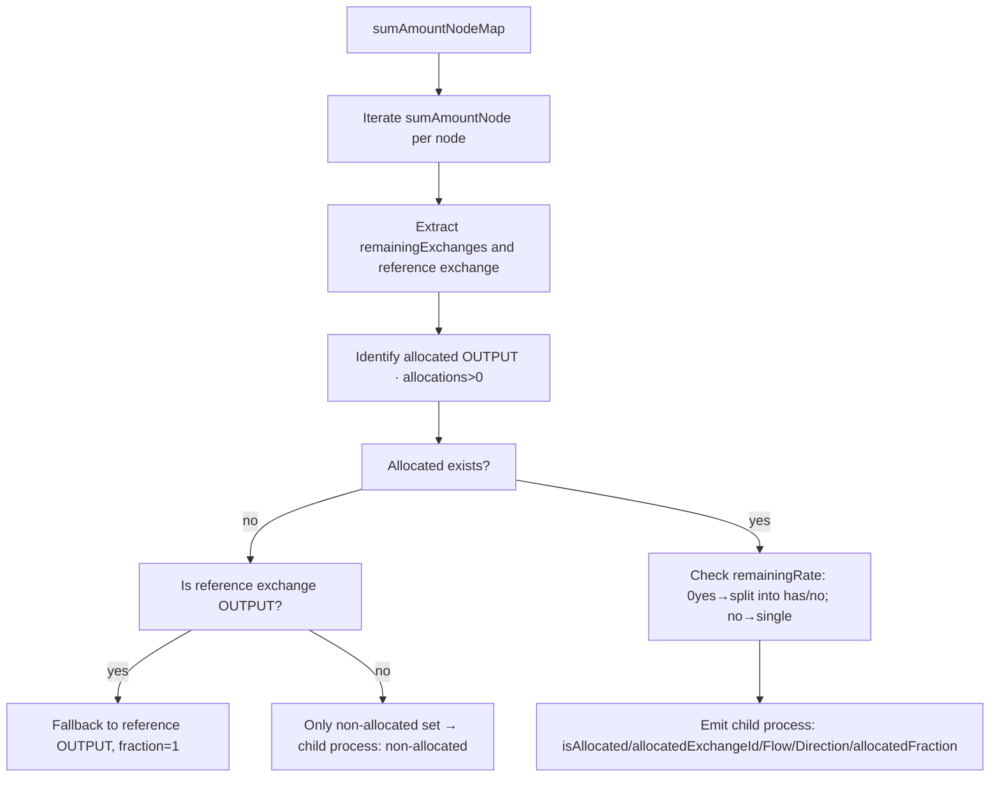

### getFinalProductGroup(finalProductProcess, allocatedFraction, scalingPercentage, allocatedProcesses, allUp2DownEdges)

- Location: same as above
- Purpose: starting from a `finalProductType==='has'` child process, recursively collect processes along the chain that share the same `allocatedExchangeFlowId`, forming a "subproduct group".
- Matching:
  - Dependence direction is determined by `dependence` and `mainDependence` together;
  - Include adjacent child processes only when they share the same flow and the direction matches (upstream OUTPUT / downstream INPUT);
  - Accumulate `childAllocatedFraction` as part of subsequent scaling.

Rules supplement:

- Skip edges with `isCycle === true`.
- When an edge's `dependence === 'none'`, fall back to its `mainDependence` for direction matching (upstream/downstream).

Flowchart:

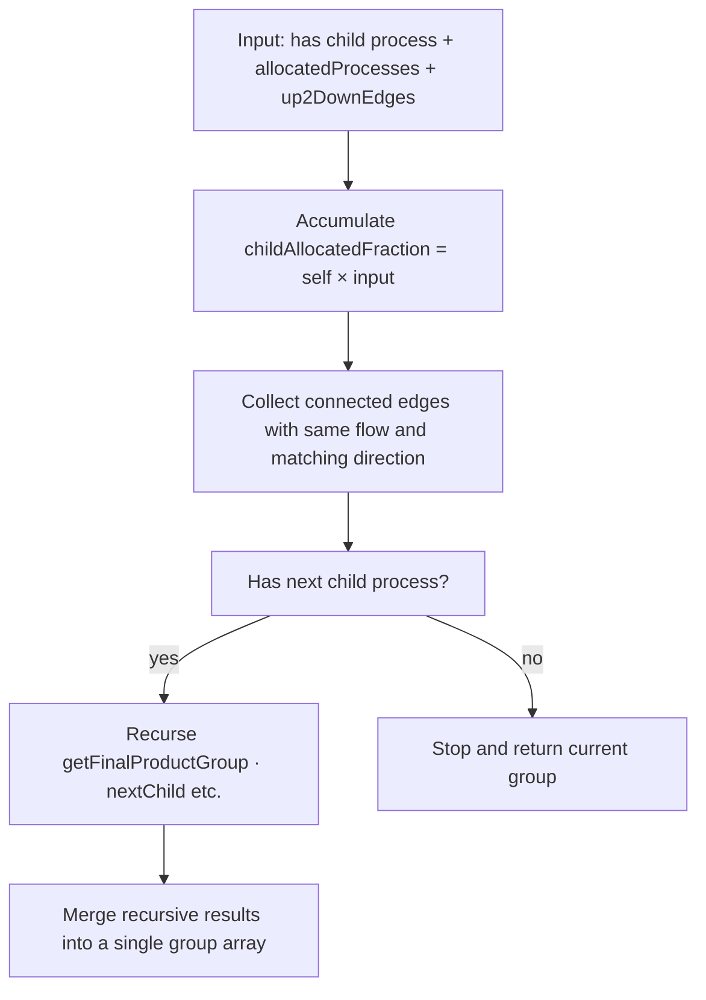

### calculateProcess(process)

- Location: same as above
- Purpose: scale `childExchanges` for each process in the group:
  - For the allocated reference exchange (`allocatedExchangeId`), do not apply group share scaling additionally; keep node-level scaling only;
  - For other exchanges, multiply by `childAllocatedFraction × childScalingPercentage`.
- Output: the process with `resultExchanges` added.

Flowchart:

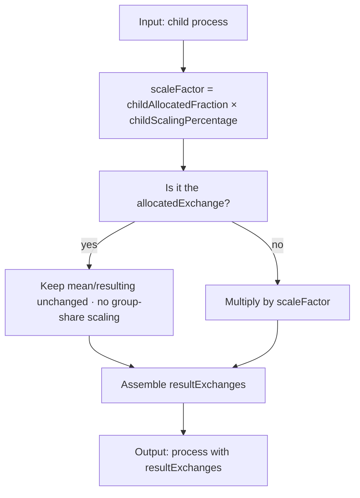

### sumProcessExchange(processExchanges)

- Location: same as above
- Purpose: aggregate scaled exchanges within a group by "direction×flowId" and mark the quantitative reference according to the final product process in the group.
- Returns: aggregated exchange array (keep only `meanAmount>0`).

Flowchart:

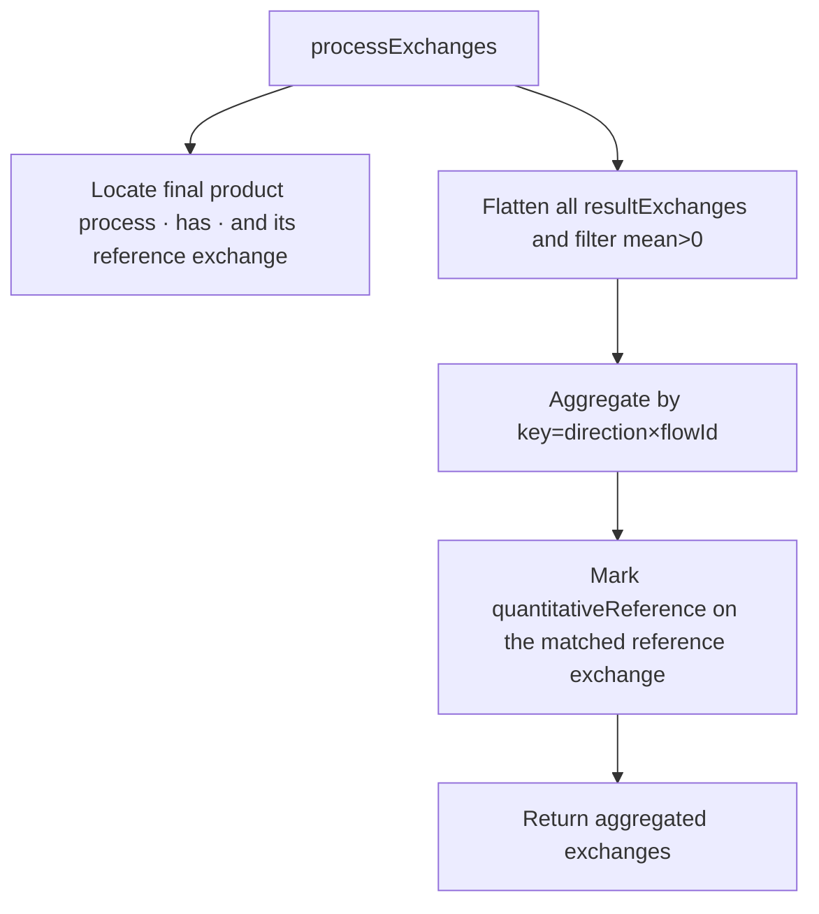

### normalizeRatio(numerator, denominator, eps?)

- Location: same as above
- Purpose: compute `r = numerator / denominator` and snap results close to 0/1 (tolerance `eps`, default 1e-6).
- Uses:
  - Compute `remainingRate = remaining / original`;
  - When judging if an edge is balanced, treat tiny errors as zero;
  - Prevent divide-by-zero and NaN/Inf propagation.

Auxiliary flow (together with nextScaling):

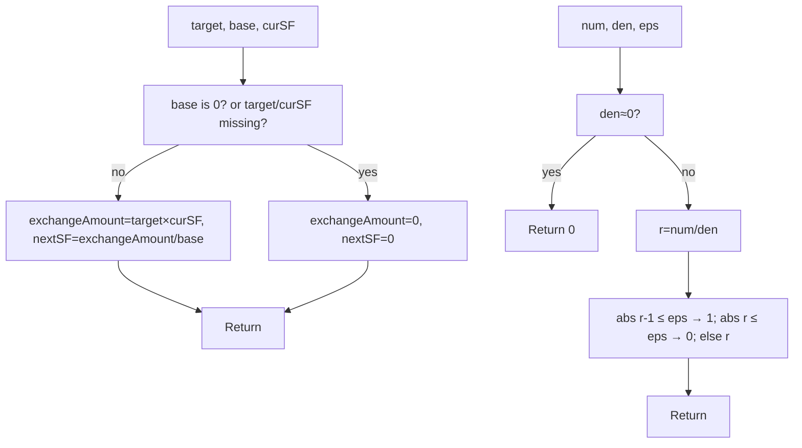

### Common utilities (general/util)

- `jsonToList(x)` / `listToJson(arr)`: convert between single-item and array structures (ILCD style compatible);
- `toAmountNumber(v)`: safely convert string/number/null to number (invalid/null → 0) before computation;
- `removeEmptyObjects(obj)`: deeply remove empty objects `{}` to produce cleaner JSON outputs;
- `mergeLangArrays(...arrs)`: merge multi-language text arrays (used for subproduct name concatenation);
- `percentStringToNumber(s)`: unify formats like `"50%"/"0.5"` into a numeric 0~1 value.

### Other internal helpers

- `dbProcessKey(id, version)`: build database process key `${id}@${version}`;
- `selectMaxAllocatedFlowId(exchanges, direction, allowedFlowIds)`: select the flowId with the highest allocation fraction given direction and allowed flows;
- `getMainOutputFlowUUID(mdProcessOutputExchanges, dbProcess)`: prefer reference OUTPUT flowId; otherwise call `selectMaxAllocatedFlowId`;
- `getMainInputFlowUUID(inputEdges, dbProcess)`: use single input edge directly; with multiple inputs prefer reference INPUT; otherwise choose the INPUT with the highest allocation fraction;
- `makeFlowKey(nodeId, flowId)` (local helper in this file): returns `${nodeId}:${flowId}`; used to build supply/demand keys and mapping back;
- `addSupplyDemandFromExchange(supply, demand, nodeId, ex)`: map an exchange to supply/demand entry (by direction);
- `pushRemainingForGroup(exchanges, nodeId, allocResult, out)`: after allocation per group, write remaining amounts back to the node's `remainingExchanges`;
- `applyAllocationToEdge(edge, allocResult)`: project `allocations/remaining_*` onto the edge; fill `exchangeAmount/isBalanced/unbalancedAmount`.

### Key types (supplement)

- `Up2DownEdge` (see `src/services/lifeCycleModels/data.ts`) commonly used fields:
  - `id, upstreamId, downstreamId, flowUUID`;
  - `mainOutputFlowUUID, mainInputFlowUUID`;
  - `dependence ∈ {upstream, downstream, none}`, and possibly `mainDependence`;
  - Filled after allocation: `exchangeAmount, isBalanced, unbalancedAmount`.

### Typical edges and numerical stability

- Input data are zero or missing:
  - `nextScaling` returns 0 when `baseAmount==0` or `targetAmount/curSF` is missing to avoid NaN;
  - `normalizeRatio` snaps ratios close to 0/1 to reduce floating noise propagation;
  - `allocateSupplyToDemand` returns zero allocation when total supply or demand does not exceed tolerance and keeps original amounts as remaining;
- Competing connections: `assignEdgeDependence` keeps the main flow and sets others to `none` into the "secondary" allocation channel;
- Primary reference alignment: when generating the primary submodel, set the exchange with the reference flow/direction to `modelTargetAmount` to ensure consistency with the model target.
