# Documentation on Status Code Changes in the Audit Process

## I. Description of Core Data Tables
| Data Table Name  | Description                     |
| ---------------- | -------------------------------- |
| Lifecyclesmodels | Model data table                 |
| Processes        | Process data table               |
| Flows            | Flow data table                  |
| Flowproperties   | Flow property data table         |
| Unitgroups       | Unit group data table            |
| Sources          | Source data table                |
| Contacts         | Contact data table               |
| reviews          | Audit administrator review task table |
| comments         | Auditor comment task table       |

## II. Definition of Status Codes
### 2.1 Data Status Codes (General Data Tables)
| Status Code | Status Description                     |
| ----------- | -------------------------------------- |
| 0           | Assigned to My Data (Unsubmitted)      |
| 20          | Assigned to My Data (Submitted, Unaudited) |
| 100         | Assigned to Open Data (Audited and Approved) |
| 200         | Assigned to Commercial Data (Audited and Approved) |

### 2.2 Auditor Recommendation Status Codes (comments table)
| Status Code | Status Description                                   |
| ----------- | ---------------------------------------------------- |
| -3          | Rejected by Auditor                                  |
| -2          | Auditor Removed                                      |
| -1          | Rejected by Audit Administrator in Review (Regardless of Auditor's Opinion) |
| 0           | Auditor Assigned, But Not Audited Yet                |
| 1           | Approved by Auditor                                  |
| 2           | Approved by Administrator in Review (Regardless of Auditor's Opinion) |

### 2.3 Audit Administrator Recommendation Status Codes (reviews table)
| Status Code | Status Description               |
| ----------- | --------------------------------- |
| -1          | Audit Rejected                    |
| 0           | Data Unassigned                   |
| 1           | Data Pending Audit                |
| 2           | Approved by Administrator in Review |

## III. Key Status Transition Rules
1. **After Assigning Unassigned Data (reviews.state_code=0)**
   - A. reviews table: state_code updated to 1
   - B. comments table: state_code updated to 0
2. **After Auditor Completes Audit for Pending Data (reviews.state_code=1)**
   - A. Auditor Approved: comments.state_code updated to 1
   - B. Auditor Rejected: comments.state_code updated to -3
3. **Final Status for Audit Approval**
   - A. comments table: state_code updated to 2
   - B. reviews table: state_code updated to 2
   - C. For all models, processes, references, and referenced-by references that are not Open/Commercial Data, state_code updated to 100 (Open Data)
4. **Final Status for Audit Rejection**
   - A. reviews table: state_code updated to -1
   - B. All related data and referenced data: state_code reset to 0
   - C. comments table: state_code updated to -1
5. **Conditions for Submitting Model Data for Audit**: The state_code of model data must be set to 20

## IV. Audit Process Flowchart

```mermaid
flowchart TD
    %% ========================= Basic Status/Data Table Nodes =========================
    A["Unsubmitted Status<br/>All referenced tables state_code = 0"]
    
    Pupd["Processes table update<br/>▸ json_ordered、rule_verification、modified_at"]
    Pget["Processes table query<br/>▸ id、version、json、state_code、rule_verification、team_id、reviews"]
    V["Data Validation Stage<br/>▸ Status Check: state_code < 20<br/>▸ Schema Required Fields Check<br/>▸ Input/Output Data Check<br/>▸ Referenced Data Completeness Check<br/>▸ Version Check"]
    Rins["Reviews table new record<br/>▸ id: Generate new UUID<br/>▸ json: Audit JSON<br/>▸ state_code = 0 (Pending Audit Assignment)<br/>▸ reviewer_id = []<br/>▸ created_at、modified_at"]
    S20["Submitted & Pending Audit Status<br/>All referenced tables state_code = 20<br/>reviews table state_code = 0"]

    %% ========================= Audit Administrator Core Process Nodes =========================
    %% Level 1: Audit Administrator · Initial Review
    AM_FIRST{"Audit Administrator · Initial Review"}
    Reject_First["Initial Review Rejected - Data Update<br/>▸ All referenced tables state_code = 0<br/>▸ reviews table state_code = -1<br/>▸ Write rejection reason to reviews.json.comment.message"]
    
    Assign["Audit Task Assignment - Data Update<br/>▸ reviews table: reviewer_id=[Auditor ID], state_code=1, append json.logs, set deadline<br/>▸ comments table new record: Associate review_id, reviewer_id, state_code=0, initialize json, write timestamp"]
    RemoveReviewer["Auditor Removal - Data Update<br/>▸ reviews table: Remove specified reviewer_id<br/>▸ comments table: Corresponding record state_code = -2"]

    %% Level 2: Auditor Audit
    Reviewer_Check{"Auditor · Audit"}
    R_Pass["Auditor Approved - Data Update<br/>comments table: state_code=1, write json.modellingAndValidation, audit comments, update modified_at"]
    R_Reject["Auditor Rejected - Data Update<br/>comments table: state_code=-3, write json.modellingAndValidation, rejection comments, update modified_at"]

    %% Level 3: Audit Administrator · Review (Final Approval)
    AM_FINAL{"Audit Administrator · Review (Final Approval)"}
    Reject_Final["Review Rejected - Data Update<br/>▸ All referenced tables state_code = 0<br/>▸ reviews table state_code = -1<br/>▸ comments table state_code = -1<br/>▸ Write final rejection reason to reviews.json.comment"]
    Pass_Final["Review Approved - Data Update (Process Completed)<br/>▸ All referenced tables state_code = 100 (Final Effective)<br/>▸ reviews table state_code = 2 (Audit Completed)<br/>▸ comments table state_code = 2 (Opinion Effective)<br/>▸ processes table update json_ordered"]

    %% ========================= Main Process Connections (Logical Closed Loop + Clear Hierarchy) =========================
    %% Submission Process: Unsubmitted → Data Operation → Pending Audit
    A -->|User initiates audit submission, system saves data| Pupd
    Pupd -->|System retrieves complete process information| Pget
    Pget -->|Comprehensive validation of data validity| V
    V -->|Initialize audit ledger record| Rins
    Rins -->|Submission completed, enter audit queue| S20

    %% Initial Review Process: Pending Audit → Initial Review → Branch Processing
    S20 --> AM_FIRST
    AM_FIRST -->|Initial review rejected, return to editing| Reject_First
    Reject_First -->|Restore user editable status| A
    AM_FIRST -->|Initial review approved, assign auditor| Assign

    %% Auditor Assignment Adjustment Branch
    Assign -->|Need to remove specified auditor| RemoveReviewer
    RemoveReviewer -->|Reassign auditor| Assign
    Assign -->|Auditor conducts data audit| Reviewer_Check

    %% Auditor Audit Branch → Audit Administrator Review
    Reviewer_Check -->|Auditor approved| R_Pass
    Reviewer_Check -->|Auditor rejected| R_Reject
    R_Pass & R_Reject -->|Submit to audit administrator for final approval| AM_FINAL

    %% Review (Final Approval) Process Branch
    AM_FINAL -->|Review rejected, return to editing| Reject_Final
    Reject_Final -->|Restore user editable status| A
    AM_FINAL -->|Review approved, process completed| Pass_Final
    AM_FINAL -->|Need supplementary audit, reassign| Assign
```
