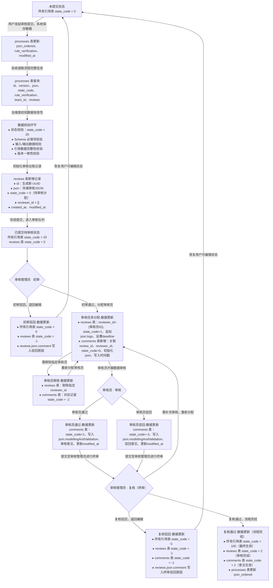

```mermaid
flowchart TD
    %% ========================= 基础状态/数据表节点 =========================
    A["未提交状态<br/>所有引用表 state_code = 0"]
    
    Pupd["processes 表更新<br/>json_ordered、rule_verification、modified_at"]
    Pget["processes 表查询<br/>id、version、json、state_code、rule_verification、team_id、reviews"]
    V["数据校验环节<br/>▸ 状态校验：state_code < 20<br/>▸ Schema 必填项校验<br/>▸ 输入/输出数据校验<br/>▸ 引用数据完整性校验<br/>▸ 版本一致性校验"]
    Rins["reviews 表新增记录<br/>▸ id：生成新 UUID<br/>▸ json：存储审核JSON<br/>▸ state_code = 0（待审核分配）<br/>▸ reviewer_id = []<br/>▸ created_at、modified_at"]
    S20["已提交待审核状态<br/>所有引用表 state_code = 20<br/>reviews 表 state_code = 0"]

    %% ========================= 审核管理员核心流程节点 =========================
    %% 第一级：审核管理员-初审
    AM_FIRST{"审核管理员 · 初审"}
    Reject_First["初审驳回-数据更新<br/>▸ 所有引用表 state_code = 0<br/>▸ reviews 表 state_code = -1<br/>▸ reviews.json.comment 写入驳回原因"]
    
    Assign["审核任务分配-数据更新<br/>▸ reviews 表：reviewer_id=[审核员ID]、state_code=1、追加json.logs、设置deadline<br/>▸ comments 表新增：关联review_id、reviewer_id、state_code=0、初始化json、写入时间戳"]
    RemoveReviewer["审核员移除-数据更新<br/>▸ reviews 表：剔除指定reviewer_id<br/>▸ comments 表：对应记录 state_code = -2"]

    %% 第二级：审核员审核
    Reviewer_Check{"审核员 · 审核"}
    R_Pass["审核员通过-数据更新<br/>comments 表：state_code=1、写入json.modellingAndValidation、审核意见、更新modified_at"]
    R_Reject["审核员驳回-数据更新<br/>comments 表：state_code=-3、写入json.modellingAndValidation、驳回意见、更新modified_at"]

    %% 第三级：审核管理员 · 复核（终审）
    AM_FINAL{"审核管理员 · 复核（终审）"}
    Reject_Final["复核驳回-数据更新<br/>▸ 所有引用表 state_code = 0<br/>▸ reviews 表 state_code = -1<br/>▸ comments 表 state_code = -1<br/>▸ reviews.json.comment 写入终审驳回原因"]
    Pass_Final["复核通过-数据更新（流程完结）<br/>▸ 所有引用表 state_code = 100（最终生效）<br/>▸ reviews 表 state_code = 2（审核完成）<br/>▸ comments 表 state_code = 2（意见生效）<br/>▸ processes 表更新 json_ordered"]

    %% ========================= 主流程连线（逻辑闭环+层级清晰） =========================
    %% 提交流程：未提交 → 数据操作 → 待审核
    A -->|用户发起审核提交，系统保存数据| Pupd
    Pupd -->|系统调取流程完整信息| Pget
    Pget -->|全维度校验数据有效性| V
    V -->|初始化审核台账记录| Rins
    Rins -->|完成提交，进入审核队列| S20

    %% 初审流程：待审核 → 初审 → 分支处理
    S20 --> AM_FIRST
    AM_FIRST -->|初审驳回，退回编辑| Reject_First
    Reject_First -->|恢复用户可编辑状态| A
    AM_FIRST -->|初审通过，分配审核员| Assign

    %% 审核员分配调整分支
    Assign -->|需移除指定审核员| RemoveReviewer
    RemoveReviewer -->|重新分配审核员| Assign
    Assign -->|审核员开展数据审核| Reviewer_Check

    %% 审核员审核分支 → 审核管理员复核
    Reviewer_Check -->|审核员通过| R_Pass
    Reviewer_Check -->|审核员驳回| R_Reject
    R_Pass & R_Reject -->|提交至审核管理员进行终审| AM_FINAL

    %% 复核（终审）流程分支
    AM_FINAL -->|复核驳回，退回编辑| Reject_Final
    Reject_Final -->|恢复用户可编辑状态| A
    AM_FINAL -->|复核通过，流程完结| Pass_Final
    AM_FINAL -->|需补充审核，重新分配| Assign

```