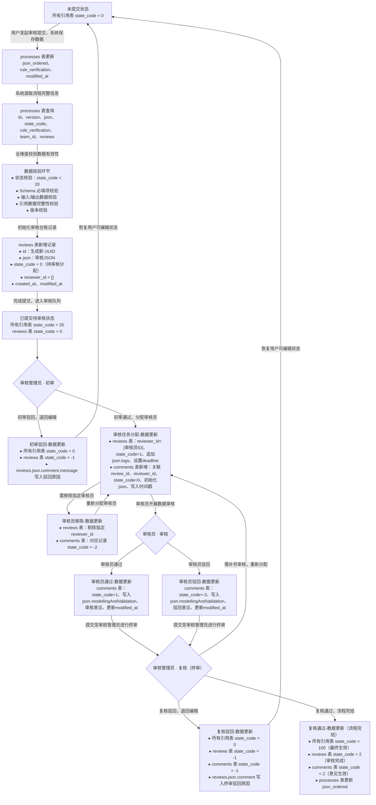

# 审核流程中状态码更改说明文档

## 一、核心数据表说明

| 数据表名称       | 说明                 |
| ---------------- | -------------------- |
| Lifecyclesmodels | 模型数据表           |
| Processes        | 过程数据表           |
| Flows            | 流数据表             |
| Flowproperties   | 流属性数据表         |
| Unitgroups       | 单位组数据表         |
| Sources          | 来源数据表           |
| Contacts         | 联系人数据表         |
| reviews          | 审核管理员评审任务表 |
| comments         | 审核员评论任务表     |

## 二、状态码定义

### 2.1 数据状态码（通用数据表）

| 状态码 | 状态说明                       |
| ------ | ------------------------------ |
| 0      | 归入我的数据（未提交）         |
| 20     | 归入我的数据（已提交、未审核） |
| 100    | 归入开放数据（已审核通过）     |
| 200    | 归入商业数据（已审核通过）     |

### 2.2 审核员建议状态码（comments表）

| 状态码 | 状态说明                                 |
| ------ | ---------------------------------------- |
| -3     | 审核员驳回                               |
| -2     | 移除审核员                               |
| -1     | 审核管理员复核驳回（无论审核员意见如何） |
| 0      | 已分配审核员、审核员未审核               |
| 1      | 审核员审核通过                           |
| 2      | 管理员复核通过（无论审核员意见如何）     |

### 2.3 审核管理员建议状态码（reviews表）

| 状态码 | 状态说明       |
| ------ | -------------- |
| -1     | 驳回审核       |
| 0      | 未分配数据     |
| 1      | 待审核数据     |
| 2      | 管理员复核通过 |

## 三、关键状态转换规则

1. **未分配数据（reviews.state_code=0）分配后**
   - A. reviews表：state_code 更新为 1
   - B. comments表：state_code 更新为 0
2. **待审核数据（reviews.state_code=1）审核员完成审核后**
   - A. 审核员通过：comments.state_code 更新为 1
   - B. 审核员驳回：comments.state_code 更新为 -3
3. **审核通过最终状态**
   - A. comments表：state_code 更新为 2
   - B. reviews表：state_code 更新为 2
   - C. 所有非开放/商业数据的模型、过程、引用及引用的引用，state_code 更新为 100（开放数据）
4. **驳回审核最终状态**
   - A. reviews表：state_code 更新为 -1
   - B. 所有相关数据及引用数据：state_code 重置为 0
   - C. comments表：state_code 更新为 -1
5. **模型数据提交审核条件**：模型数据的 state_code 需设置为 20

## 四、审核流程流程图

