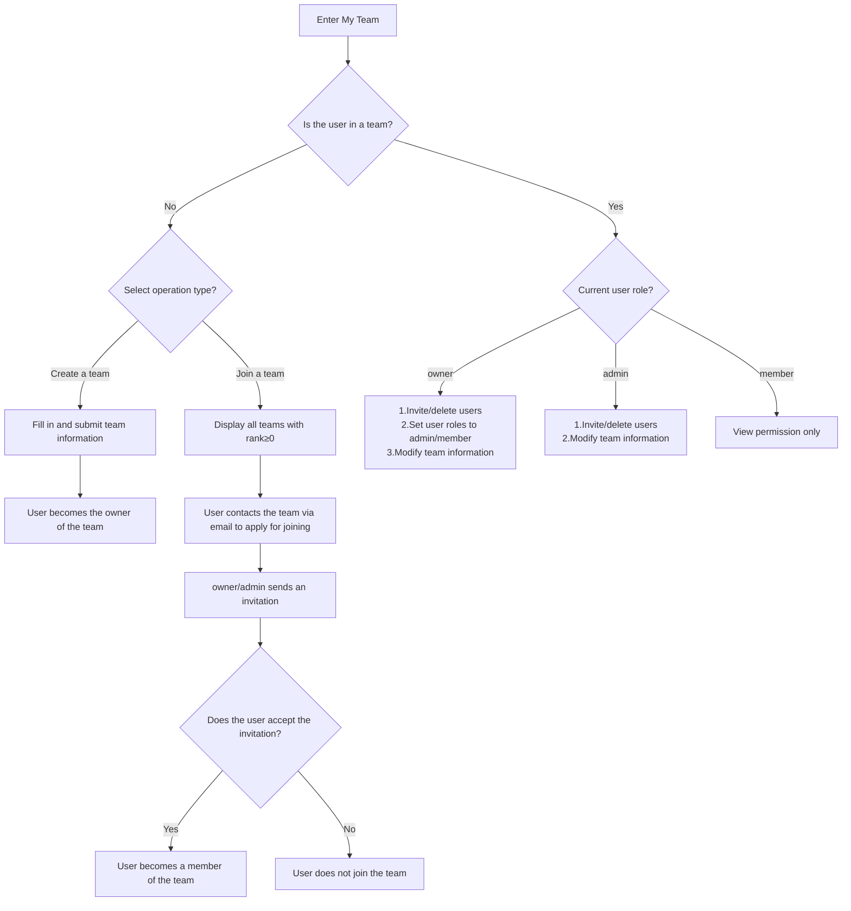

# Team Management

## Roles

1. **owner**: Invite and delete users, set user roles, modify team information.
2. **admin**: Invite and delete users, modify team information.
3. **member**: View permission only.

## Business Logic

1. **Click My Team**: a. User is in a team: Display team information and member information. b. User is not in any team: Pop up a prompt that the user can join a team or create a team. i. Join a team: Display all team information with rank≥0, and the user contacts the team via email to join. ii. Create a team: Fill in team information.
2. **Member Information**: Perform member management operations according to roles.

