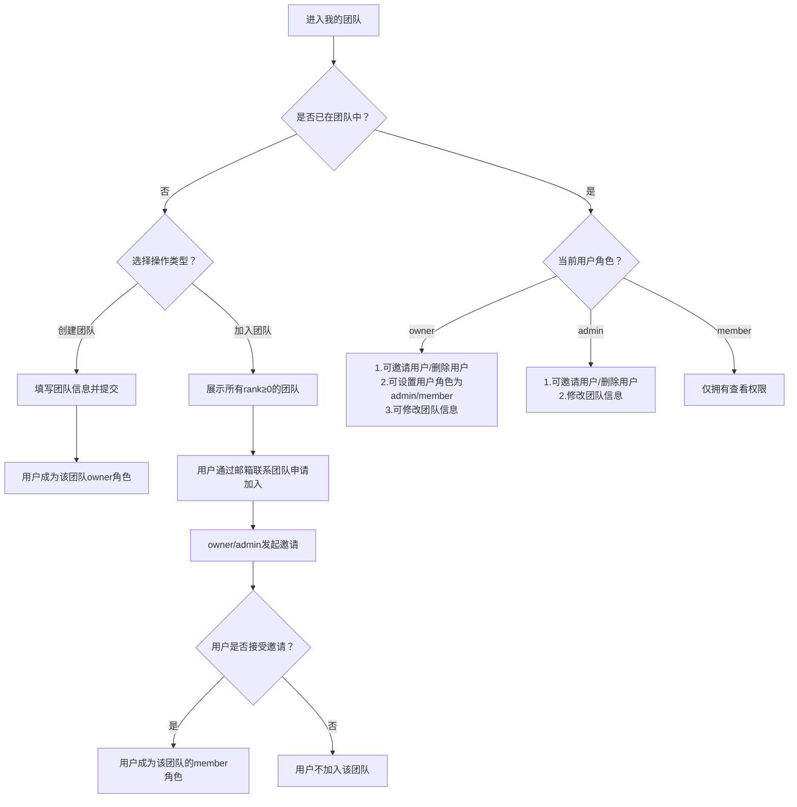

# 团队管理

## 角色
1. **owner**：邀请、删除用户，设置用户角色，修改团队信息。
2. **admin**：邀请、删除用户，修改团队信息。
3. **member**：只有查看权限。

## 业务逻辑
1. **点击我的团队**：
    a. 用户在某个团队中：展示团队信息、成员信息。
    b. 用户不在某个团队中：弹框提示用户可以加入团队或者创建团队。
        i. 加入团队：展示全部rank>=0的团队信息，用户根据邮箱联系加入团队。
        ii. 创建团队：填写团队信息。
2. **成员信息**：根据角色，进行成员管理操作
