# util_calculate（中文镜像）

> 说明：英文版 `docs/agents/util_calculate.md` 是唯一面向 AI 的文档；本文件为同步的中文说明，供人类同事查阅。若英文版变更，需同步更新此处。

本文档梳理 `genLifeCycleModelProcesses` 的业务逻辑与数据流，帮助理解生命周期模型子模型生成/更新的整体过程。

## 函数签名与职责

- 函数：`genLifeCycleModelProcesses(id, modelNodes, lifeCycleModelJsonOrdered, oldSubmodels)`
- 输入：
  - `id: string` 当前生命周期模型的主模型 ID。
  - `modelNodes: any[]` 画布/模型节点列表（含节点元数据，如 quantitativeReference、targetAmount）。
  - `lifeCycleModelJsonOrdered: any` 按标准结构整理过的 LCA 模型 JSON（包含 technology.processes.processInstance 等）。
  - `oldSubmodels: any[]` 既有的子模型记录（用于二次运行时判定更新/复用）。
- 输出：
  - `{ lifeCycleModelProcesses: any[] }` 生成（或更新）的子模型数组（过滤掉空项）。
- 职责：
  - 从模型与数据库进程构建有向边（上游→下游，按 flow 匹配），标注依赖方向。
  - 以引用过程为起点传播缩放系数，按主/次连接分组，进行供需分配。
  - 形成“已分配的子过程”，从候选最终产品出发分组，缩放并汇总交换量，计算 LCIA，生成或更新子模型数据。

## 关键数据与概念

- 参考过程（Reference Process）
  - 来源：`lifeCycleModelInformation.quantitativeReference.referenceToReferenceProcess`（nodeId）。
  - 对应模型节点：`modelNodes` 中 `data.quantitativeReference === '1'` 的节点。
  - 参考流（Ref Exchange）：数据库进程中与定量参考匹配的 exchange，用于确定参考方向（INPUT/OUTPUT）与参考流 ID。
- 缩放因子（Scaling Factor）
  - `refScalingFactor = modelTargetAmount / refModelMeanAmount`（均非 0 时）。
  - 通过 `calculateScalingFactor` 在图上沿依赖关系传播到相关节点与交换。
- 依赖方向（dependence）
  - `assignEdgeDependence` 标注每条边的 `dependence ∈ { upstream, downstream, none }`，决定进入“主连接”还是“次连接”分组。
- 供需分配（Allocation）
  - 对每个节点聚合后的 exchange，构造供给（OUTPUT）与需求（INPUT）字典，键为 `${nodeId}:${flowId}`。
  - 使用 `allocateSupplyToDemand(supply, demand, edges)` 对主/次两组分别求解匹配，输出分配、剩余供给/需求。
- 子过程（Allocated Process）
  - 按聚合结果拆分为“已分配 OUTPUT”与“未分配/其它”，形成可用于后续分组与缩放的子过程集合。
- 最终产品分组（Final Product Group）
  - 从 `finalProductType === 'has'` 的子过程出发，递归收集同一子产品链条，形成一组用于汇总与 LCIA 的过程。

## 执行流程（高层步骤）

1. 读取参考过程 nodeId，校验存在；定位参考模型节点与目标产量 `modelTargetAmount`。
2. 构造模型进程列表与映射（`mdProcesses`, `mdProcessMap`）。
3. 根据模型中引用的 process id/version 批量查询数据库进程（`supabase.from('processes')...`），构建 `dbProcessMap`：
   - 解析 exchanges 列表，找出参考 exchange，确定参考流 ID 与方向；按 flowId 建立 INPUT/OUTPUT 索引。
4. 计算参考缩放因子 `refScalingFactor`。
5. 构图与标注：`buildEdgesAndIndices` 生成 `up2DownEdges` 与两类索引；`assignEdgeDependence` 标注边的依赖类型。
6. 缩放传播：以参考过程为起点调用 `calculateScalingFactor`，得到所有涉及过程的缩放记录 `processScalingFactors`。
7. 聚合：`sumAmountByNodeId` 按 nodeId 聚合缩放与 exchange，得到 `sumAmountNodeMap`，区分 `mainConnectExchanges`、`secondaryConnectExchanges`、`noneConnectExchanges`。
8. 供需构建与分配：
   - 为主组、次组分别扫描 `sumAmountNodeMap` 构建 supply/demand 字典与边列表。
   - 分别调用 `allocateSupplyToDemand`，得到 `mainAllocateResult` 与 `secondaryAllocateResult`。
9. 写回剩余与边状态：
   - 将每个组的 `remaining_supply`/`remaining_demand` 映射回节点，计算 `remainingRate` 等。
   - 更新 `up2DownEdges` 的 `exchangeAmount`、`isBalanced`、`unbalancedAmount`。
10. 形成子过程：`allocatedProcess(sumAmountNodeMap)`。
11. 查找最终产品候选：过滤 `finalProductType === 'has'` 的子过程。
12. 分组与缩放：
    - 对每个候选通过 `getFinalProductGroup` 收集同组过程。
    - 调用 `calculateProcess` 对组内过程根据 `childAllocatedFraction`、`childScalingPercentage` 等进行缩放，得到 `resultExchanges`。
13. 组内汇总与参考标记：`sumProcessExchange` 按方向与 flowId 聚合交换，标记定量参考。
14. 生成（或更新）子模型：
    - 若为主组（primary），`option=update`，`newId=id`；若为次组（secondary），默认 `option=create`、`newId=v4()`，若存在匹配 `oldSubmodels` 则 `option=update` 并沿用旧 id。
    - 对主组，参考交换与模型目标产量对齐（覆盖 mean/resulting）。
    - 计算 LCIA：`LCIAResultCalculation(newExchanges)`。
    - 组装 `processDataSet`、`LCIAResults` 等结构，产出一条子模型记录。
15. 写回 processInstance：根据聚合的 `scalingFactor` 更新每条 `processInstance` 的 `@multiplicationFactor`。
16. 返回 `{ lifeCycleModelProcesses }`，过滤掉空项。

### 执行流程图

下图以 Mermaid 流程图展示 `genLifeCycleModelProcesses` 的主要数据对象及其流转关系（从输入到输出），便于快速理解端到端的处理链路：

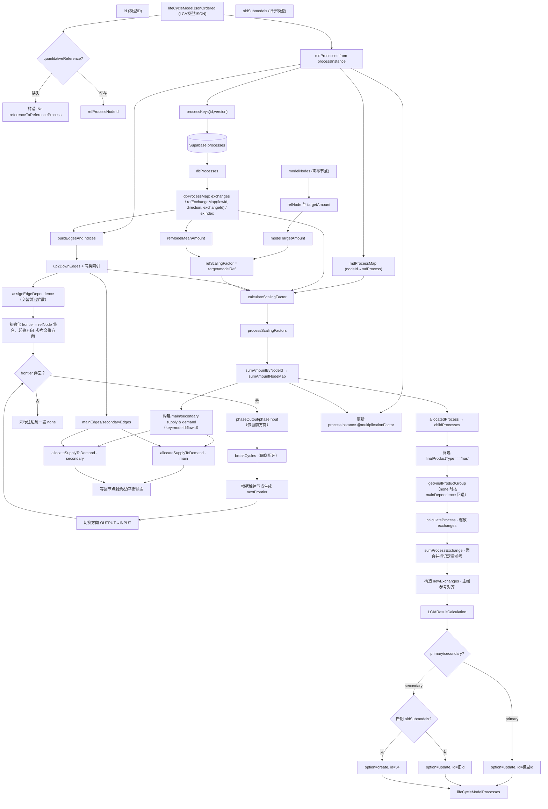

说明：

- 图中以 nodeId:flowId 作为供需匹配的键；主/次分组依赖于 `dependence ∈ {upstream, downstream, none}`。
- 主组（primary）在生成子模型时会将参考交换量与 `modelTargetAmount` 对齐。
- 旧子模型通过 `nodeId/processId/allocatedExchange{FlowId,Direction}` 进行匹配后决定更新或新建。

- 修改 `allocateSupplyToDemand` 的容差或优先级策略时，务必更新相关单测与本文档“边界情况”部分。
- 引入新分组逻辑或 `dependence` 类型时，注意：
  1. up/down edges 的分配通道；
  2. `allocatedProcess` 的已分配/未分配划分；
  3. `sumProcessExchange` 的聚合键（方向×flowId）是否需要扩展。

## 关键辅助函数角色（与本流程强相关）

- `buildEdgesAndIndices(mdProcesses, dbProcessMap)`：建立上游→下游边与“按下游输入/按上游输出”的索引。
- `assignEdgeDependence(up2DownEdges, edgesByDownstreamInput, edgesByUpstreamOutput, refProcessNodeId)`：从参考过程起，按拓扑给每条边标注 `dependence`。
- `calculateScalingFactor(...)`：双向沿 `dependence` 遍历，按共享 `flowUUID` 传播缩放；收集每个节点/交换的缩放记录。
- `sumAmountByNodeId(processScalingFactors)`：按节点聚合缩放与 exchange，区分连接类型（main/secondary/none）。
- `allocateSupplyToDemand(supplies, demands, edges, initialAllocations?, options?)`：在同一 flow 上进行供给→需求的最大匹配/分配；可选 `prioritizeBalance`，以及容差（见单元测试）。
- `normalizeRatio(num, den, eps)`：计算比值并对接近 0/1 的结果做归一处理（避免浮点噪声）。
- `calculateProcess(process)`：根据分组内累计比例（`childAllocatedFraction×childScalingPercentage`）缩放交换；若为被分配的参考交换，仅按 `scalingFactor` 缩放。
- `sumProcessExchange(processExchanges)`：组内聚合并识别定量参考交换。
- `LCIAResultCalculation(newExchanges)`：对最终的交换清单计算 LCIA 结果。

## 主要数据结构要点

- 边（Up2DownEdge，摘录）：
  - `upstreamId`, `downstreamId`, `flowUUID`, `dependence`, `exchangeAmount`, `isBalanced`, `unbalancedAmount`。
- 节点聚合项（sumAmountNode）：
  - `nodeId`, `scalingFactor`, `mainConnectExchanges`, `secondaryConnectExchanges`, `noneConnectExchanges`, `remainingExchanges`。
- 数据库进程映射（DbProcessMapValue，摘要）：
  - `id`, `version`：进程标识
  - `exchanges: any[]`：数据库进程的展平交换列表
  - `refExchangeMap`：定量参考信息
    - `exchangeId`（参考交换在进程内的 ID）、`flowId`（参考流 ID）、`direction: 'INPUT'|'OUTPUT'`、`refExchange`（原始参考交换对象）
  - `exIndex`：按 `flowId` 建立的索引
    - `inputByFlowId: Map<string, any>`、`outputByFlowId: Map<string, any>`
- 分配结果（allocateSupplyToDemand 返回）：
  - `allocations`: 嵌套字典，`allocations[upKey][downKey] = amount`。
  - `remaining_supply`, `remaining_demand`, `total_delivered`。
  - 容差策略：支持绝对 `tolerance` 与相对 `relTolerance`；可 `prioritizeBalance`。

## 决策点与边界情况

- 未找到 `referenceToReferenceProcess`：抛错，流程中止。
- 数据库中未找到参考过程：抛错（`Reference process not found in database`）。
- 目标产量/参考均为 0：`refScalingFactor` 置为 1（避免除 0），依赖后续逻辑对 0 量处理。
- `allocateSupplyToDemand` 的容差：
  - 若 `tolerance` 大于供需总和，可能早退为 0 分配（见单测 `tolerance=1e-6`）。
  - 使用 `relTolerance` 在数量级极小时保持精度（避免把合法的 1e-9 量当作 0）。
- 边 `isBalanced` 判断：当 `remaining_supply==0 && remaining_demand==0` 或分配>0 且相对差为 0（归一到 0）。
- 主/次分组：`dependence ∈ {upstream, downstream}` 归为主组，`none` 为次组。
- 主组参考对齐：主组的参考交换在生成子模型时会用 `modelTargetAmount` 覆盖。
- 旧子模型复用：按 `nodeId / processId / allocatedExchange{FlowId,Direction}` 匹配并决定 `option=update` 与 `id` 复用。

## 输出副作用（对输入 JSON 的更新）

- 覆盖写回：`lifeCycleModelInformation.technology.processes.processInstance` 中每个实例的 `@multiplicationFactor`。

## 调用示例（伪）

```ts
const { lifeCycleModelProcesses } = await genLifeCycleModelProcesses(
  modelId,
  nodes,
  orderedJson,
  previousSubmodels,
);
// lifeCycleModelProcesses: [{ option, modelInfo, data }, ...]
```

## 维护建议

## 被调用方法详解（详述各辅助能力）

以下方法为 `genLifeCycleModelProcesses` 在“构图→依赖→缩放→分配→汇总→LCIA”主流程中的直接或间接依赖，按出现与调用关系分组说明。

### buildEdgesAndIndices(mdProcesses, dbProcessMap)

- 位置：`src/services/lifeCycleModels/util_calculate.ts`
- 作用：
  - 从 LCA 模型中的 `processInstance` 生成上游→下游的边 `Up2DownEdge[]`；
  - 为每个节点计算并标记“主输出流 mainOutputFlowUUID”与“主输入流 mainInputFlowUUID”；
  - 生成两个检索索引：`edgesByDownstreamInput(nodeId→其所有入边)`、`edgesByUpstreamOutput(nodeId→其所有出边)`。
- 输入：
  - `mdProcesses: any[]` 模型中的进程实例列表；
  - `dbProcessMap: Map<string, DbProcessMapValue>` 数据库进程映射（含 exchanges 与 refExchangeMap）。
- 输出：`{ up2DownEdges, edgesByDownstreamInput, edgesByUpstreamOutput }`
- 关键点：
  - 主输出流：优先使用数据库参考交换为 OUTPUT 的 flowId，否则在允许集合内选择“分配比例最高”的 OUTPUT 流；
  - 主输入流：若节点有多条入边，优先数据库参考 INPUT 流，否则在入边 flow 集合内选择“分配比例最高”的 INPUT 流；
  - 依赖选择内部用到 `selectMaxAllocatedFlowId` 与 `comparePercentDesc`（按分配比例选择）。
- 边界：节点无输出/输入时主流 UUID 为空字符串；无匹配 flow 时不设置。

流程图：

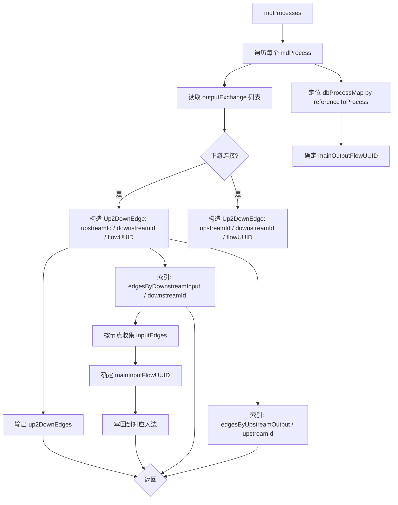

### assignEdgeDependence(up2DownEdges, edgesByDownstream, edgesByUpstream, refProcessNodeId)

- 位置：同上
- 作用：以参考节点为起点，交替向 OUTPUT/INPUT 方向扩张，为边打上 `dependence ∈ {downstream, upstream, none}` 标记；当同向多条边存在时，仅保留“主流”作为主依赖，其余置为 `none` 并记录 `mainDependence`。
- 输入：已构建的边与索引以及参考节点 ID
- 输出：原地修改 `up2DownEdges`（写入 dependence/mainDependence）
- 关键点：
- 交替扩张：以参考方向为起点，phaseOutput/phaseInput 交替推进，以“前沿(frontier)”在图上扩散，直到没有新增节点；每轮完成后执行对应方向断环（breakDownstreamCycles 或 breakUpstreamCycles）。
- 标注完成后，仍未被标注的边统一置为 `none`（作为“次组”处理）。
- 分阶段扩张并记录“被触达节点”，在该批内做去重：同一上游节点多条 downstream 依赖仅保留主输出流；同一下游节点多条 upstream 依赖仅保留主输入流；
- 下一轮 frontier 只从“仍有未标注边”的节点推进，提高效率。

流程图：

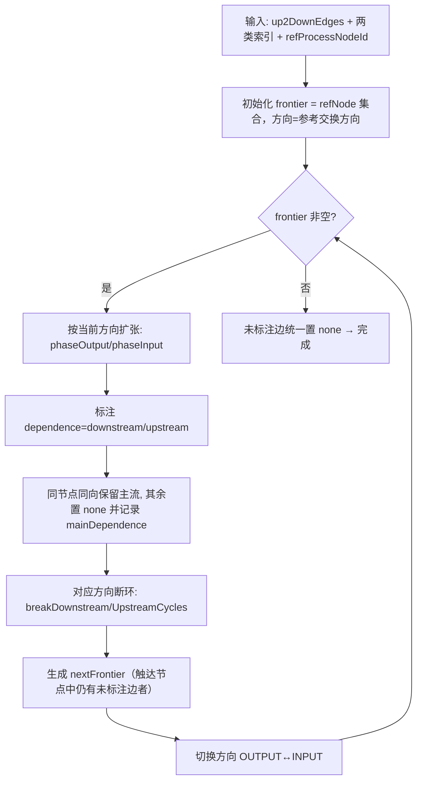

### calculateScalingFactor(currentModelProcess, currentDatabaseProcess, ...)

- 位置：同上
- 作用：从当前节点沿已标注的依赖边双向遍历，按共享 `flowUUID` 在相邻进程间传播缩放系数，并收集每个节点的缩放后 exchanges 与分组（main/secondary/none）。
- 输入：
  - `currentModelProcess, currentDatabaseProcess` 起点模型/数据库进程；
  - `dependence` 起点上下文（首个为空壳对象即可）；
  - `scalingFactor` 起点缩放因子（参考缩放系数）；
  - `edgesByDownstreamInput, edgesByUpstreamOutput, mdProcessMap, dbProcessMap` 图与索引。
- 输出：`any[]`（进程缩放记录，含 nodeId、scalingFactor、三类 exchanges、baseExchanges 等）
- 算法要点：
  - 对当前节点：将数据库 exchanges 乘以当前 `scalingFactor` 得到缩放后交换；
  - 沿输入边处理期望 dependence=downstream；沿输出边期望 dependence=upstream；
  - 相邻缩放传播：`nextScaling(target=currentMean, base=adjacentMean, curSF=scalingFactor)`，并在边上写回 `exchangeAmount`。

流程图：

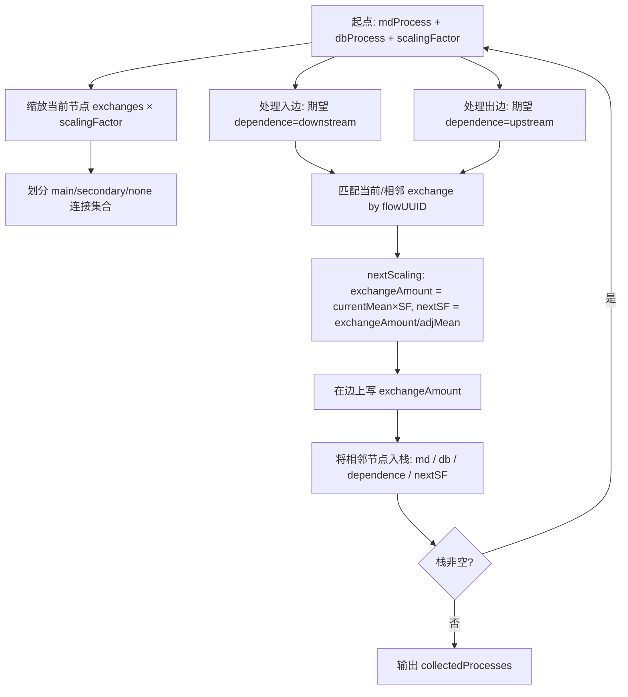

### nextScaling(targetAmount, baseAmount, curSF)

- 位置：同上
- 作用：计算下一个缩放因子与当前边交换量：`exchangeAmount = targetAmount × curSF`，`nextScalingFactor = exchangeAmount / baseAmount`。
- 返回：`{ exchangeAmount, nextScalingFactor }`
- 边界：若 `baseAmount` 为 0 或 `targetAmount/curSF` 缺失，返回 0；采用 BigNumber 保证数值稳定。

### mergeExchangesById(prevList?, nextList?)

- 位置：同上
- 作用：按 `@dataSetInternalID` 聚合两个交换列表的 `meanAmount/resultingAmount`；不修改入参，返回新数组。
- 用途：`sumAmountByNodeId` 在同节点多次到达时合并三类交换与总交换。

### sumAmountByNodeId(processScalingFactors)

- 位置：同上
- 作用：将遍历产生的进程缩放记录按 `nodeId` 聚合：累加 `scalingFactor/count`，并合并三类交换与总交换。
- 返回：`Map<string, any>`（nodeId → 聚合结果条目）
- 过滤：`scalingFactor==0` 或缺少 `nodeId` 的记录会跳过。

流程图：

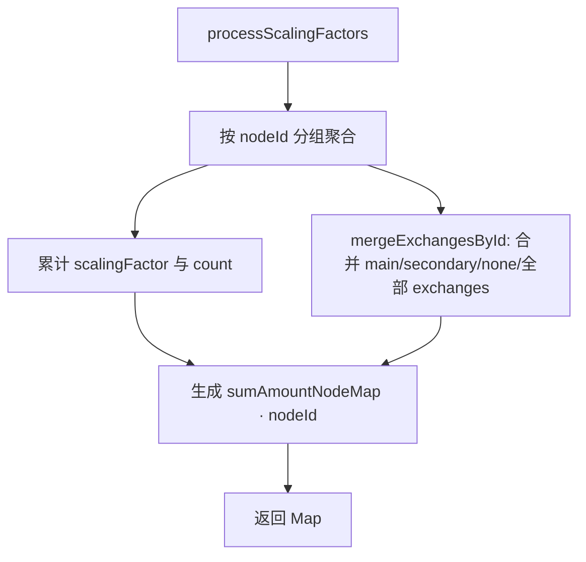

### allocatedProcess(sumAmountNodeMap)

- 位置：同上
- 作用：基于节点聚合结果，将交换拆分为“已分配 OUTPUT（有分配比例或参考 OUTPUT 兜底）”与“未分配/其他”，生成“子过程”列表供后续分组与缩放。
- 规则：
  - 若存在有效 `allocations/allocation.@allocatedFraction` 的 OUTPUT，则进入已分配集合；
  - 若没有已分配 OUTPUT，但参考交换为 OUTPUT，则以参考 OUTPUT 兜底（比例=1）；
  - 参考 OUTPUT 如未被选入已分配，则作为未分配交换保留；
  - 对存在 `remainingRate(0<r<1)` 的情况，拆分为 has/no 两条子过程，比例互补。

流程图：

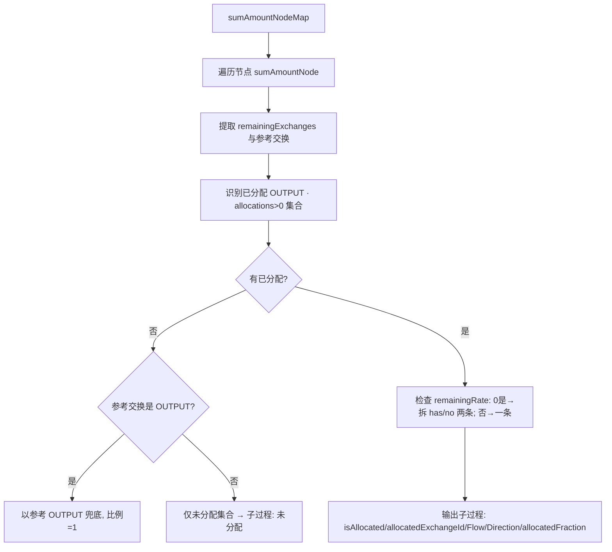

### getFinalProductGroup(finalProductProcess, allocatedFraction, scalingPercentage, allocatedProcesses, allUp2DownEdges)

- 位置：同上
- 作用：从一个 `finalProductType==='has'` 的子过程出发，沿着与之相连且同一 `allocatedExchangeFlowId` 的链条递归收集同组过程，形成“子产品组”。
- 匹配：
  - 依赖方向以 `dependence` 与 `mainDependence` 共同决定；
  - 仅当相邻子过程包含同一 flow 且方向匹配（上游 OUTPUT / 下游 INPUT）时纳入组；
  - 组内累计 `childAllocatedFraction` 作为后续缩放比例的一部分。

规则补充：

- 跳过 `isCycle === true` 的边；
- 当边 `dependence==='none'` 时，按其 `mainDependence` 参与方向匹配（upstream/downstream）。

流程图：

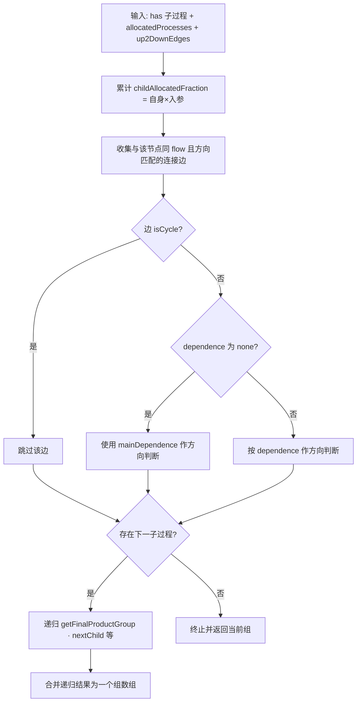

### calculateProcess(process)

- 位置：同上
- 作用：对组内每个子过程的 `childExchanges` 进行缩放：
  - 已分配的参考交换（`allocatedExchangeId` 对应的那一条）不额外按组份额缩放，只保留节点自带的缩放结果；
  - 其他交换按 `childAllocatedFraction × childScalingPercentage` 等比缩放。
- 输出：在过程上新增 `resultExchanges`。

流程图：

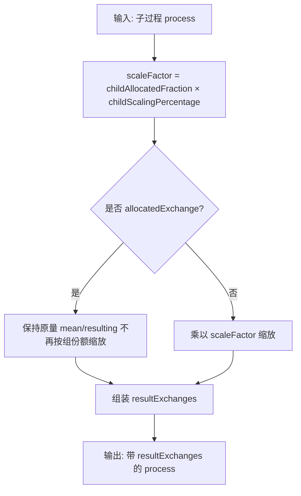

### sumProcessExchange(processExchanges)

- 位置：同上
- 作用：对同组内缩放后的交换进行“方向×flowId”聚合累加，并依据组内的最终产品过程标记定量参考交换。
- 返回：合并后的交换数组（仅保留 `meanAmount>0`）。

流程图：

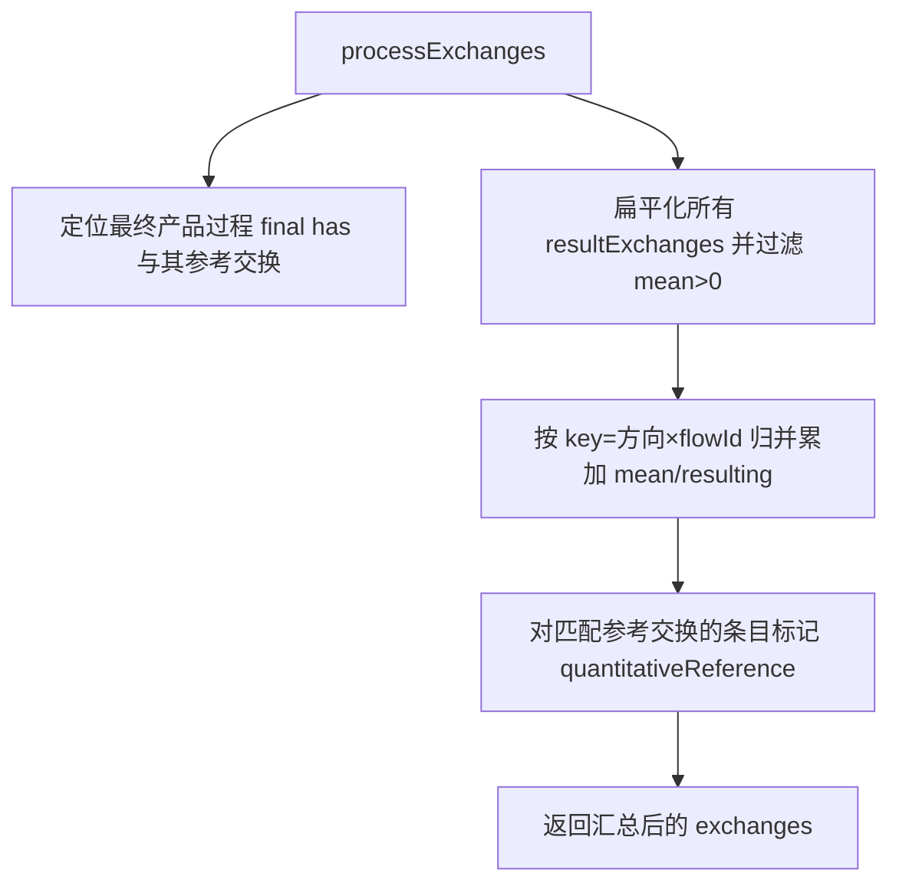

### normalizeRatio(numerator, denominator, eps?)

- 位置：同上
- 作用：计算 `r = numerator / denominator`，并对接近 0/1 的结果做“吸附”归一处理（容差 `eps`，默认 1e-6）。
- 用途：
  - 计算 `remainingRate = remaining / original`（剩余/原始）；
  - 判断边是否平衡时，将极小误差视为 0；
  - 防止 0 除与 NaN/Inf 传染。

辅助流程图（与 nextScaling 合并展示）：

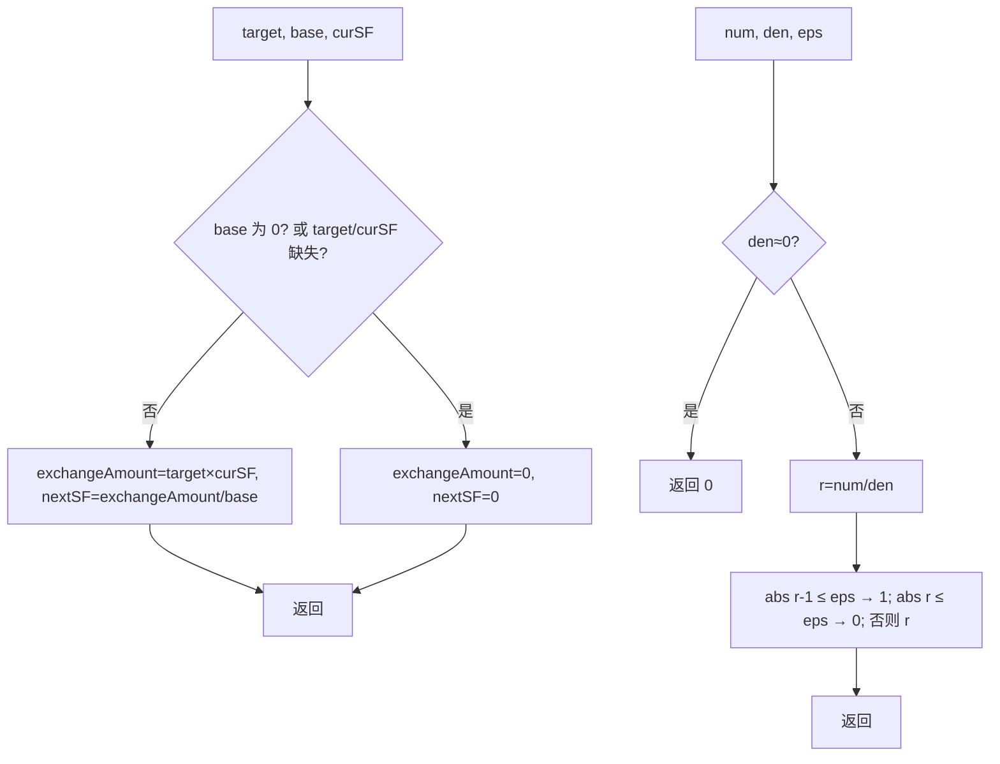

### 供需分配 allocateSupplyToDemand(supplies, demands, edges, edgeCapacities?, opts?)

- 位置：`src/services/lifeCycleModels/util_allocate_supply_demand.ts`
- 作用：在给定 supply/demand 与允许的供需连边下，使用 Edmonds–Karp 最大流进行分配；支持启发式 `prioritizeBalance`、绝对/相对容差。
- 输入/输出契约：
  - supplies/demands 均为非负数；edges 为 `[u,v]` 组成的迭代器（`u/v` 为 `nodeId:flowId`）；
  - `edgeCapacities` 以 `${u}→${v}` 为键（Unicode 箭头）指定容量；未指定时默认容量为 `max(totalSupply,totalDemand)`；
  - 输出四元组：`{ allocations, remaining_supply, remaining_demand, total_delivered }`；
  - 容差：`eps = max(tolerance, relTolerance * scale)`，`scale = max(totalSupply,totalDemand)`；当总量极小时需适当减小容差以保留有效流。
- 算法要点：
  - 构建容量图：`SOURCE→供给节点；需求节点→SINK；u→v` 为业务边；
  - BFS 逐层增广，若启用 `prioritizeBalance`，会优先从“小供给/小需求”路径推进；
  - 汇总仅针对业务边写出 `allocations`，并逐节点计算剩余供需。

流程图：

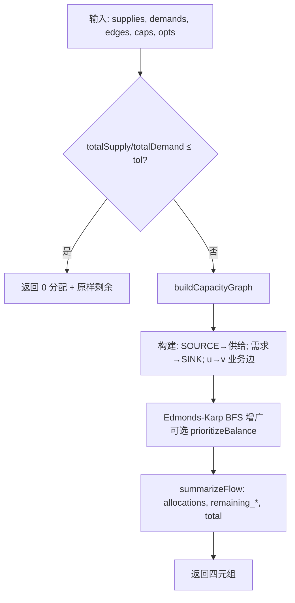

### LCIAResultCalculation(exchangeDataSource)

- 位置：`src/services/lciaMethods/util.ts`
- 作用：对交换清单进行 LCIA 计算；内部具备浏览器端 IndexedDB 缓存与 gzip 解压：
  1. 优先从缓存读取 `list.json` 与 `flow_factors.json.gz`；未命中则下载、解压并写入缓存；
  2. 以 `${flowId}:${direction}` 为键快速查找表征因子；
  3. 将交换量（meanAmount）与因子值相乘并按方法分组聚合；
  4. 产出 `LCIAResultTable[]`（去零）。
- 注意：该函数运行在浏览器环境，需要 `indexedDB` 与 `DecompressionStream` 支持。

流程图：

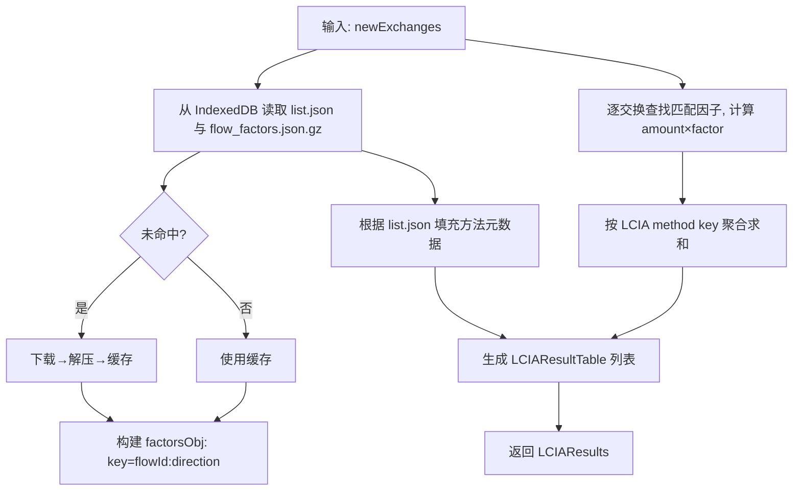

### 常用通用工具（general/util）

- `jsonToList(x)` / `listToJson(arr)`：在单项与数组结构之间相互转换，兼容 ILCD 风格字段；
- `toAmountNumber(v)`：将字符串/数字/空值安全转换为 number（非法/空返回 0），用于计算前归一；
- `removeEmptyObjects(obj)`：深度移除空对象 `{}`，用于生成更简洁的 JSON 输出；
- `mergeLangArrays(...arrs)`：合并多段多语种文本数组（用于子产品命名拼接）；
- `percentStringToNumber(s)`：将如 `"50%"/"0.5"` 等形式统一为 `0~1` 的数值。

### 其他内部辅助

- `dbProcessKey(id, version)`：构造数据库进程键 `${id}@${version}`；
- `selectMaxAllocatedFlowId(exchanges, direction, allowedFlowIds)`：在给定方向与允许 flow 集合内，选出“分配比例最高”的 flowId（若无返回空字符串）；
- `getMainOutputFlowUUID(mdProcessOutputExchanges, dbProcess)`：优先使用参考 OUTPUT 的 flowId，否则调用 `selectMaxAllocatedFlowId`；
- `getMainInputFlowUUID(inputEdges, dbProcess)`：单入边直接使用；多入边时优先参考 INPUT，否则选择“分配比例最高”的 INPUT；
- `makeFlowKey(nodeId, flowId)`（本文件局部帮助函数）：返回 `${nodeId}:${flowId}`，用于构建供需与映射回写；
- `addSupplyDemandFromExchange(supply, demand, nodeId, ex)`：将 exchange 映射为供给/需求条目（按方向分流）；
- `pushRemainingForGroup(exchanges, nodeId, allocResult, out)`：把主/次组分配后的剩余量回写到节点的 `remainingExchanges`；
- `applyAllocationToEdge(edge, allocResult)`：将 `allocations/remaining_*` 投影回边对象，补充 `exchangeAmount/isBalanced/unbalancedAmount`。

分配结果回写流程图（pushRemainingForGroup / applyAllocationToEdge）：

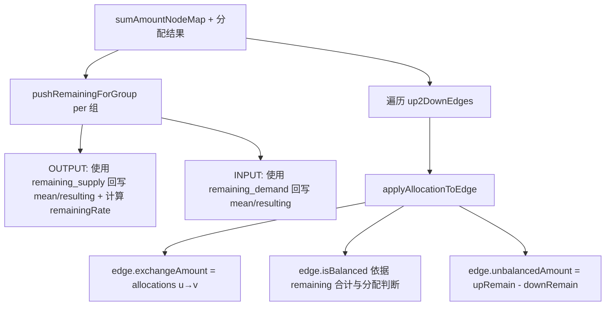

### 关键类型（补充）

- `Up2DownEdge`（见 `src/services/lifeCycleModels/data.ts`）常用字段：
  - `id, upstreamId, downstreamId, flowUUID`；
  - `mainOutputFlowUUID, mainInputFlowUUID`；
  - `dependence ∈ {upstream, downstream, none}`，以及可能的 `mainDependence`；
  - 分配后填充：`exchangeAmount, isBalanced, unbalancedAmount`。

### 典型边界与数值稳定性

- 输入数据为 0 或缺失：
  - `nextScaling` 在 `baseAmount==0` 或 `targetAmount/curSF` 缺失时返回 0，避免 NaN；
  - `normalizeRatio` 对接近 0/1 的比例做归一，减少浮点噪声传导；
  - `allocateSupplyToDemand` 若总供或总需不超过容差，直接返回 0 分配并保留原始供需为剩余；
- 多条连接竞争：`assignEdgeDependence` 保留主流，其余置为 `none` 进入“次组”分配通道；
- 主组参考对齐：主组生成子模型时，将与参考流/方向匹配的参考交换量覆盖为 `modelTargetAmount`；若参考交换的 `remainingRate` ∈ (0, 1)，则除参考交换外，其余 exchanges 与 LCIA 结果统一按 `1/remainingRate` 放大，以保持主组与模型目标产量一致。
- 性能与稳定性：实现层面采用 `Set/Map` 降低重复扫描，统一使用 `BigNumber` 做精度计算，并尽量避免不必要的中间数组创建。

## 方法数据流流程图

以下图示化展示 `genLifeCycleModelProcesses` 所调用关键方法的数据流向与中间步骤，便于按模块定位与排障。

### buildEdgesAndIndices


### assignEdgeDependence

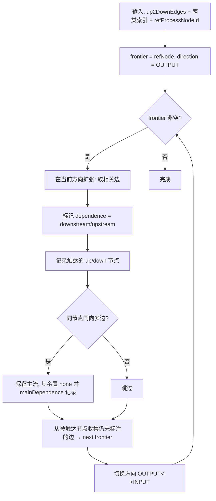

### calculateScalingFactor（含 nextScaling）


### sumAmountByNodeId（含 mergeExchangesById）


### allocateSupplyToDemand（最大流分配）


### 分配结果回写（pushRemainingForGroup / applyAllocationToEdge）


### allocatedProcess（生成子过程）


### getFinalProductGroup（子产品分组）

```mermaid
graph TD
  A[输入: has 子过程 + allocatedProcesses + up2DownEdges]
  A --> B[累计 childAllocatedFraction = 自身×入参]
  B --> C[收集与该节点同 flow 且方向匹配的连接边]
  C --> D{存在下一子过程?}
  D -->|是| E[递归 getFinalProductGroup · nextChild 等]
  D -->|否| F[终止并返回当前组]
  E --> G[合并递归结果为一个组数组]
```

### calculateProcess（组内缩放）

```mermaid
graph TD
  A[输入: 子过程 process] --> B[scaleFactor = childAllocatedFraction × childScalingPercentage]
  B --> C{是否 allocatedExchange?}
  C -->|是| D[保持原量 mean/resulting 不再按组份额缩放]
  C -->|否| E[乘以 scaleFactor 缩放]
  D --> F[组装 resultExchanges]
  E --> F
  F --> G[输出: 带 resultExchanges 的 process]
```

### sumProcessExchange（组内汇总与参考标记）

```mermaid
graph TD
  A[processExchanges] --> B[定位最终产品过程 final has 与其参考交换]
  A --> C[扁平化所有 resultExchanges 并过滤 mean>0]
  C --> D[按 key=方向×flowId 归并累加 mean/resulting]
  D --> E[对匹配参考交换的条目标记 quantitativeReference]
  E --> F[返回汇总后的 exchanges]
```

### LCIAResultCalculation（LCIA 计算与缓存）

```mermaid
graph TD
  A[输入: newExchanges] --> B[从 IndexedDB 读取 list.json 与 flow_factors.json.gz]
  B --> C{未命中?}
  C -->|是| D[下载→解压→缓存]
  C -->|否| E[使用缓存]
  D --> F[构建 factorsObj: key=flowId:direction]
  E --> F
  A --> G[逐交换查找匹配因子, 计算 amount×factor]
  G --> H[按 LCIA method key 聚合求和]
  B --> I[根据 list.json 填充方法元数据]
  H --> J[生成 LCIAResultTable 列表]
  I --> J
  J --> K[返回 LCIAResults]
```

### 辅助：nextScaling / normalizeRatio（数值守护）

```mermaid
graph TD
  A[target, base, curSF] --> B{base 为 0? 或 target/curSF 缺失?}
  B -->|是| C[exchangeAmount=0, nextSF=0]
  B -->|否| D[exchangeAmount=target×curSF, nextSF=exchangeAmount/base]
  D --> E[返回]
  C --> E

  F[num, den, eps] --> G{den≈0?}
  G -->|是| H[返回 0]
  G -->|否| I[r=num/den]
  I --> J[abs r-1 ≤ eps → 1; abs r ≤ eps → 0; 否则 r]
  J --> K[返回]
```
